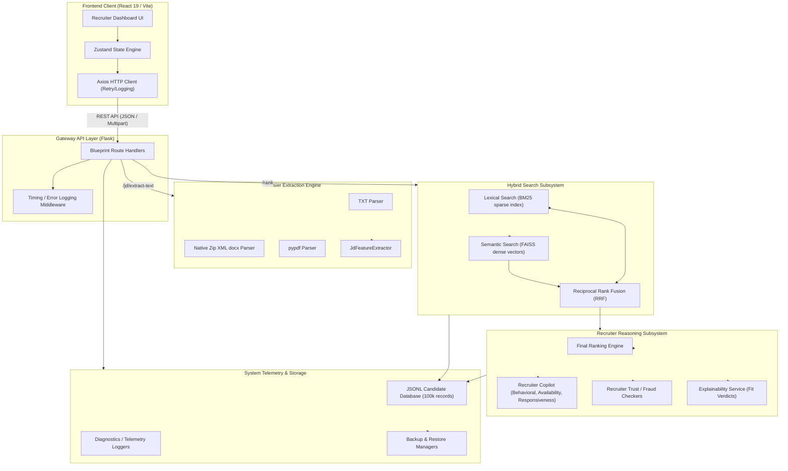

# 🤖 Talent Intelligence AI Recruiter (LinkedIn Premium Recruiter Clone)

[](https://opensource.org/licenses/MIT)
[](https://www.python.org/)
[](https://react.dev/)
[](https://tailwindcss.com/)
[]()

> A state-of-the-art talent acquisition platform designed for high-scale recruitments, featuring lexical-semantic hybrid retrieval, dynamic ranking engines, recruiter copilot behavior analytics, and a comprehensive DevOps observability launch suite.

---

## 📸 Platform Highlights

- **Hybrid Search Fusion**: Combines lexical exact matching (BM25) with semantic dense vectors (FAISS index) using Reciprocal Rank Fusion (RRF).
- **Executive JD Dossier Parser**: High-performance parsing of `.txt`, `.docx` (via native zip XML traversal), and `.pdf` (via `pypdf`) files to automatically generate requirements, competencies, notice periods, and weight profiles.
- **Recruiter Copilot**: AI-advisor offering explainable fit verdicts, behavioral consistency checks, candidate availability timelines, and candidate join probability index scores.
- **DevOps Launch cockpit**: Interactive production readiness panel tracking Core Web Vitals, API latency telemetry, diagnostics checks, environment nodes, and secrets verification.
- **Judge Presentation Suite**: Dynamic tour controls, database backup/restore centers, and final submission CSV packagers.

---

## 🏗️ System Architecture



---

## 🛠️ Technology Stack

| Component | Technology | Purpose |
| :--- | :--- | :--- |
| **Frontend Core** | React 19, TypeScript, Vite | High-performance React application structure |
| **Styling** | TailwindCSS, Custom HSL themes | Premium glassmorphic interface with micro-animations |
| **State Management** | Zustand (Persistent LocalStorage) | Fast, atomic global state slices |
| **Data Fetching** | TanStack Query v5 (React Query) | Server caching, background refetching, retry policies |
| **Animations** | Framer Motion | Smooth dashboard transitions and motion-reduced support |
| **Backend Framework**| Flask (Python 3.12) | API Gateway & Middleware Routing |
| **Vector Search** | FAISS (Dense index) | Semantic context match based on profile embeddings |
| **Lexical Search** | BM25 (Sparse index) | Keyword match for syntax, frameworks, and exact criteria |
| **Text Extraction** | `pypdf`, native `zipfile` & `xml.etree` | Multi-format parser for JD documents |
| **Diagnostics** | ReportLab | PDF Report generator fallbacks to Markdown/HTML |
| **Unit Testing** | pytest, Vitest | Dual-engine verification for backend/frontend |

---

## 📁 Repository Directory Structure

```
Talent-Intelligence-Recruiter/
├── backend/                       # Python Flask API Subsystem
│   ├── api/                       # API routes blueprint, schemas, and middleware
│   │   ├── middleware/            # Timing tracker, request loggers, error handlers
│   │   ├── routes/                # Endpoints (jd, rank, explain, metrics, copilot, etc.)
│   │   └── schemas/               # Request/Response validation models (Pydantic)
│   ├── models/                    # Domain structures (ParsedJD, RankedCandidate, etc.)
│   ├── services/                  # Core algorithms (BM25, FAISS, Hybrid, RRF, Copilot)
│   ├── tests/                     # 310+ test assertions (pytest)
│   ├── app.py                     # Flask application factory entry point
│   ├── config.py                  # Configurations (dev, prod, test environment configs)
│   └── requirements.txt           # Python application dependencies
│
├── frontend/                      # React Frontend Client
│   ├── src/                       # Application source
│   │   ├── api/                   # Axios client endpoints configurations
│   │   ├── services/              # API interfaces (jdService, rankingService)
│   │   ├── store/                 # Zustand stores (appStore, candidateStore)
│   │   ├── theme/                 # Design system tokens and HSL palettes
│   │   ├── components/            # Shared UI components, charts, layout cards
│   │   ├── pages/                 # Route page components (JDAnalysis, Dashboard, System)
│   │   └── routes/                # React Router v7 definitions
│   ├── package.json               # Node.js dependencies
│   └── vite.config.ts             # Vite server configurations
│
└── docs/                          # Architecture guides, system walkthroughs, and logs
```

---

## 🚀 Getting Started

### 1. Prerequisites
- **Python**: version 3.12.x or higher
- **Node.js**: version 18.x or higher (npm 9.x+)

### 2. Backend Setup
1. Navigate to the `backend/` directory:
   ```bash
   cd backend
   ```
2. Create and activate a python virtual environment:
   ```bash
   python -m venv venv
   # On Windows:
   venv\Scripts\activate
   # On macOS/Linux:
   source venv/bin/activate
   ```
3. Install dependencies:
   ```bash
   pip install -r requirements.txt
   ```
4. Setup environment variables by copying `.env.example` to `.env`:
   ```bash
   cp .env.example .env
   ```
5. Launch the Flask API server:
   ```bash
   python app.py
   ```
   *The server starts by default on [http://localhost:5000](http://localhost:5000).*

### 3. Frontend Setup
1. Navigate to the `frontend/` directory:
   ```bash
   cd ../frontend
   ```
2. Install npm dependencies:
   ```bash
   npm install
   ```
3. Boot the Vite development environment server:
   ```bash
   npm run dev
   ```
   *The client dev environment launches on [http://localhost:5173](http://localhost:5173).*

---

## 🧪 Verification & Testing

### Running Backend Unit Tests
We maintain **314 test assertions** covering embedding generators, retrievers, rankers, copilot recommendations, and API blueprints:
```bash
cd backend
python -m pytest
```

### Compiling Frontend Bundle
Verify that all TypeScript code types and imports compile cleanly for production optimization builds:
```bash
cd frontend
npm run build
```

---

## 💎 Design System & Motion Standards

- **Theme Palettes**: Slate and dark layout structures accented by bright electric-blue nodes. Responsive color coding for match verdicts:
  - `Strong Hire` (Emerald ring & badges)
  - `Interview` (Amber outlines)
  - `Backup` (Slate indicators)
- **Glassmorphic Glass Panels**: Utilizes Tailwind backdrop blurs combined with thin semi-transparent borders for visual layering.
- **Accessibility AA Standards**: Features keyboard tab selections, custom focus states, and native system motion-reduction audits (`prefers-reduced-motion`) that automatically disable Framer Motion animations when toggled.

---

## 🏆 Submission & Presentation Suite
Click **Launch Center** in the sidebar navigation menu to access:
1. **Launch Checklist**: 100% compliant audits verifying environments, secrets configurations, secure CORS policies, and browser storage states.
2. **System Diagnostics**: Real-time observability sparklines tracking API latency, memory profiles, client error counts, and server load volumes.
3. **Backup & Restore**: Live export configurations allowing you to backup database settings to local JSON and restore configurations dynamically.
4. **Presentation Guides**: Assisted presentation triggers, slide outlines, diagram mappings, and judge tour indicators.
