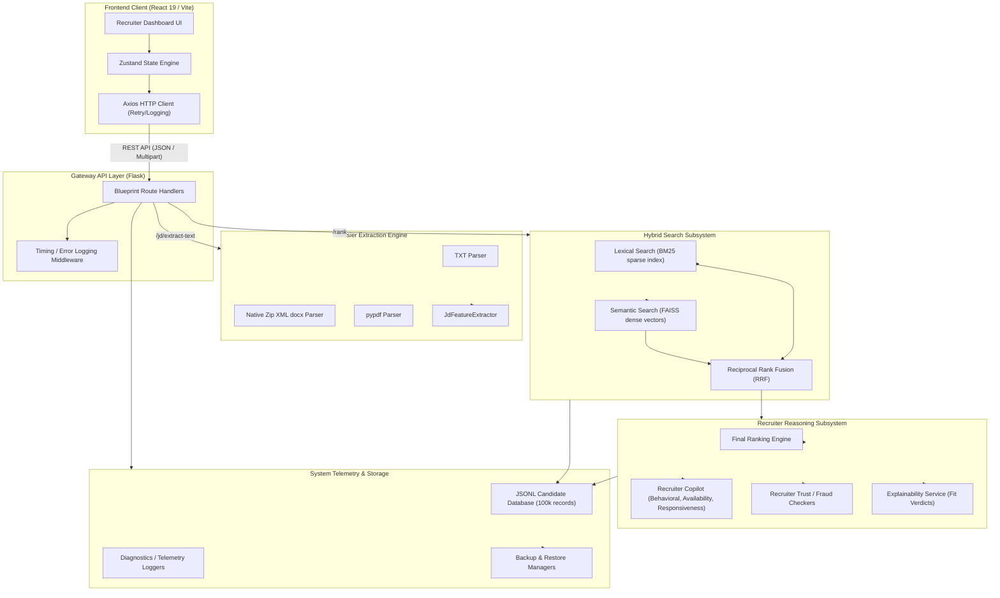

# Nexa AI - Talent Recruiter Platform

[](https://opensource.org/licenses/MIT)
[](https://www.python.org/)
[](https://react.dev/)
[](https://tailwindcss.com/)

A talent acquisition platform designed for scalable recruitment processes. It features a lexical-semantic hybrid retrieval system, dynamic ranking engines, recruiter copilot behavior analytics, and a comprehensive observability suite.

---

## Platform Highlights

- **Hybrid Search Fusion**: Integrates lexical exact matching (BM25) with semantic dense vectors (FAISS index) using Reciprocal Rank Fusion (RRF).
- **Job Description (JD) Parsing Engine**: Supports parsing of `.txt`, `.docx` (via native zip XML traversal), and `.pdf` (via `pypdf`) files to automatically extract requirements, competencies, notice periods, and weight profiles.
- **Recruiter Copilot**: An AI-assisted advisor providing explainable candidate fit verdicts, behavioral consistency checks, availability timelines, and join probability estimates.
- **System Observability Dashboard**: An interactive panel tracking Core Web Vitals, API latency telemetry, diagnostic checks, environment node status, and configuration verification.
- **Presentation and Administration Suite**: Includes dynamic system tours, database backup and restoration controls, and final submission data packaging.

---

## System Architecture



---

## Technology Stack

| Component | Technology | Purpose |
| :--- | :--- | :--- |
| **Frontend Core** | React 19, TypeScript, Vite | User interface and application structure |
| **Styling** | TailwindCSS | Component styling and responsive design |
| **State Management** | Zustand (Persistent LocalStorage) | Global state management |
| **Data Fetching** | TanStack Query v5 (React Query) | Server caching, background refetching, and retry policies |
| **Backend Framework**| Flask (Python 3.12) | API Gateway and Middleware Routing |
| **Vector Search** | FAISS (Dense index) | Semantic context matching based on profile embeddings |
| **Lexical Search** | BM25 (Sparse index) | Keyword matching for exact criteria |
| **Text Extraction** | `pypdf`, native `zipfile` & `xml.etree` | Multi-format parsing for documents |
| **Diagnostics** | ReportLab | Report generation capabilities |
| **Unit Testing** | pytest, Vitest | Verification and testing across the backend and frontend |

---

## Repository Directory Structure

```text
Talent-Intelligence-Recruiter/
├── backend/                       # Python Flask API Subsystem
│   ├── api/                       # API routes blueprint, schemas, and middleware
│   │   ├── middleware/            # Timing tracker, request loggers, error handlers
│   │   ├── routes/                # Endpoints
│   │   └── schemas/               # Request/Response validation models (Pydantic)
│   ├── models/                    # Domain structures
│   ├── services/                  # Core algorithms (BM25, FAISS, Hybrid, RRF, Copilot)
│   ├── tests/                     # Test suite (pytest)
│   ├── app.py                     # Flask application entry point
│   ├── config.py                  # Environment configurations
│   └── requirements.txt           # Python dependencies
│
├── frontend/                      # React Frontend Client
│   ├── src/                       # Application source code
│   │   ├── api/                   # API client configurations
│   │   ├── services/              # API interfaces
│   │   ├── store/                 # Zustand stores
│   │   ├── components/            # Shared UI components
│   │   ├── pages/                 # Route page components
│   │   └── routes/                # Router definitions
│   ├── package.json               # Node.js dependencies
│   └── vite.config.ts             # Vite server configurations
│
└── docs/                          # Architecture documentation and guides
```

---

## Getting Started

### 1. Prerequisites
- **Python**: Version 3.12.x or higher
- **Node.js**: Version 18.x or higher (npm 9.x+)

### 2. Backend Setup
1. Navigate to the `backend/` directory:
   ```bash
   cd backend
   ```
2. Create and activate a python virtual environment:
   ```bash
   python -m venv venv
   # On Windows:
   venv\Scripts\activate
   # On macOS/Linux:
   source venv/bin/activate
   ```
3. Install dependencies:
   ```bash
   pip install -r requirements.txt
   ```
4. Setup environment variables by copying `.env.example` to `.env`:
   ```bash
   cp .env.example .env
   ```
5. Launch the Flask API server:
   ```bash
   python app.py
   ```
   *The server starts by default on http://localhost:5000.*

### 3. Frontend Setup
1. Navigate to the `frontend/` directory:
   ```bash
   cd ../frontend
   ```
2. Install npm dependencies:
   ```bash
   npm install
   ```
3. Start the development server:
   ```bash
   npm run dev
   ```
   *The client environment launches on http://localhost:5173.*

---

## Verification and Testing

### Running Backend Unit Tests
The test suite covers embedding generators, retrievers, rankers, copilot recommendations, and API endpoints. Execute the following commands to run the tests:
```bash
cd backend
python -m pytest
```

### Compiling Frontend Bundle
Verify that the TypeScript codebase compiles successfully for production builds:
```bash
cd frontend
npm run build
```

---

## Design and Accessibility Standards

- **Theme**: Slate and dark layout structures accented by blue nodes. Responsive color coding for match verdicts (`Strong Hire`, `Interview`, `Backup`).
- **Accessibility**: Includes keyboard navigation, custom focus states, and native system motion-reduction compliance (`prefers-reduced-motion`) to minimize animations when required.

---

## Administration Suite
Accessible via the **Launch Center** in the sidebar navigation menu:
1. **System Audits**: Environment verification, secrets configurations, secure CORS policies, and browser storage states.
2. **System Diagnostics**: Observability tracking API latency, memory profiles, client error counts, and server load volumes.
3. **Backup and Restore**: Functionality to backup configurations to local JSON files and restore them as needed.
