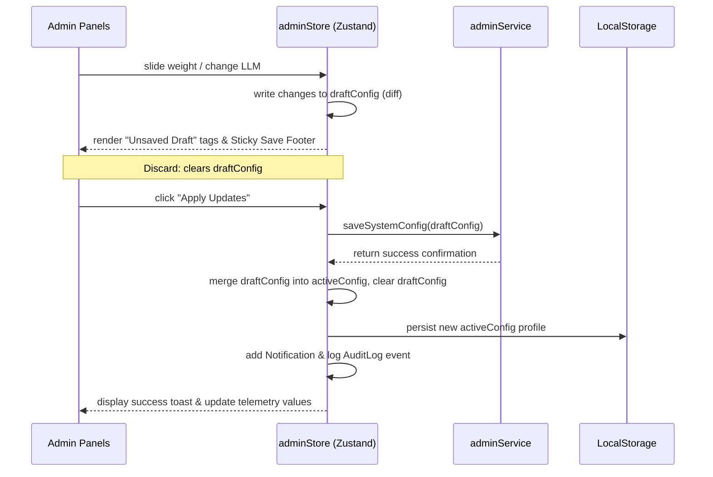

# Enterprise Admin Console & AI Configuration Center Documentation (Phase 11)

This console allows system administrators and hackathon judges to calibrate scoring heuristics, tune retrieval parameters, configure model hyperparameters, inspect operational telemetries, manage user invites, and activate maintenance modes.

---

## 1. Component Hierarchy

```
[AdminDashboardPage] (Console Shell & Tab Dispatcher)
 ├── [Header & Maintenance Warning Banner]
 ├── [Onboarding Tour Guide Cards]
 ├── [AdminSidebar] (Sections tab toggles: Overview, Calibrations, Access, Logs)
 ├── [Tab: System Overview]
 │    ├── [SystemOverviewCard] (Status, Health score, Live uptime, Services Status)
 │    └── [NotificationCenter] (Real-time operational alerts with swipe dismiss)
 ├── [Tab: AI Calibrations]
 │    ├── [AIModelConfigPanel] (LLM active select, embedding paths, temperature sliders)
 │    ├── [RetrievalConfigPanel] (Top-K limits, hybrid BM25/FAISS weights, similarities threshold)
 │    ├── [RankingWeightsEditor] (Calibrations sliders, live sum check normalization, impact previews)
 │    └── [FeatureFlagsPanel] (Platform modular toggles with animated switch indicators)
 ├── [Tab: User Access Control]
 │    ├── [UserManagementPanel] (Searchable recruiter lists, role editors, invite modals)
 │    └── [RolePermissionsPanel] (Interactive checks grid demonstrating RBAC systems)
 ├── [Tab: Diagnostics & Logs]
 │    ├── [APIUsagePanel] (Line/Area Recharts graphs plotting latency & throughput)
 │    ├── [SystemDiagnosticsPanel] (Hardware CPU, RAM allocations, FAISS vector status chips)
 │    ├── [MaintenanceModePanel] (Toggle lock, modal confirmations, custom banner inputs)
 │    ├── [ConfigurationBackupPanel] (JSON file backups downloads, schema validator uploads)
 │    └── [DangerZonePanel] (Severe resets with Stripe-like typed verify actions)
 ├── [AdminActivityTimeline] (Vertical chronological event log grouped by date)
 └── [Unsaved Changes Sticky Footer] (Modified diff logs, Revert and Apply Save buttons)
```

---

## 2. Configuration State Flow



---

## 3. Heuristic Weight Safeties

Scoring weights calibration includes multiple programmatic guards:
- **Sum Verification:** standard weights are evaluated dynamically to check if cumulative values equal exactly 100% (1.0).
- **Proportional Normalization:** If the standard weights do not sum to 100%, the UI displays a warning banner and calculates the effective relative percentage of each weight, preventing math errors in score pipelines.
- **Dynamic Score Simulation:** Live preview tables evaluate scores for candidate prototypes (Alex, Elena, Chris) using modified weights on the fly so admins see calculations impact before syncing to databases.

---

## 4. Security & Hardening

- **Danger Zone Verification:** reset weights, purging caches, removing export files, or freezing systems require typing `CONFIRM` inside inputs to enable click buttons, preventing accidental triggers.
- **Configuration Backup Validation:** JSON configuration uploads are parsed and verified against strict schemas before import. If vector keys, embedding structures, or weights scopes are missing, the import aborts showing a red error description.
- **Maintenance Lockdown:** Enabling maintenance mode overrides standard router layouts globally, locking normal sessions and displaying the warning banner.

---

## 5. Accessibility & Responsive Targets

- **Visible Focus States:** Focus rings (`.focus-ring`) are styled with blue glows, enabling full keyboard tab traversal across all sliders, buttons, inputs, and dropdown selectors.
- **ARIA Declarations:** Dropdown selectors, modals, tables, and toggles use explicit `aria-label`, `aria-selected`, and `role` labels for screen readers.
- **Reduced Motion:** Interactive spring animations adapt to standard settings.
- **WCAG AA Contrast:** Soft text prompts use high contrast HSL color combinations against glass backdrops.
