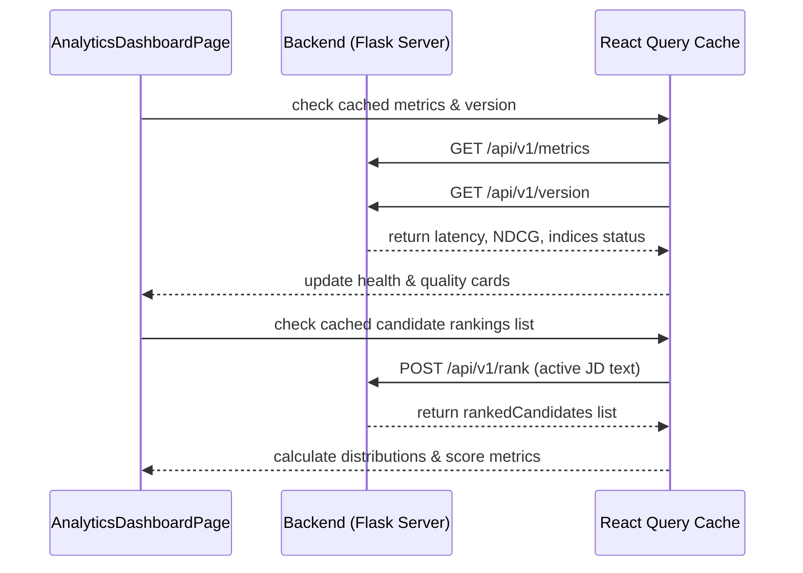

# AI Recruiter Analytics, Reporting & Submission Center Documentation (Phase 10)

This page provides recruiters and hackathon judges with system quality evaluations, information retrieval (IR) accuracies, pool statistics, and submissions download controls.

---

## 1. Component Hierarchy

```
[AnalyticsDashboardPage] (Dashboard Orchestrator)
 ├── [AnalyticsHero] (Total Pool, shortlisted KPIs and telemetry latency)
 ├── [MetricCards] (Aggregations like Strong Hire Verdicts, Avg Tech Depth, Match Confidence)
 ├── [DashboardFilters] (Selective selectors to filter candidates pool details)
 ├── [ExecutiveSummaryCard] (AI Dynamic pool assessments, strengths, and concern items)
 ├── [Charts Dashboard Grid]
 │    ├── [ScoreBreakdownChart] (Distribution histograms for candidate score parameters)
 │    ├── [CandidateDistributionChart] (Bar chart maps for Location, Experience, Degree, and Availability)
 │    ├── [RecommendationPieChart] (Verdict shares breakdown: Strong Hire, Hire, Interview, Consider)
 │    ├── [ReliabilityHistogram] (Timeline and experience integrity index buckets check)
 │    ├── [ExperienceDistribution] (Years of experience buckets groups)
 │    └── [SkillCoverageChart] (Radial matches comparison: Required vs Preferred vs Gaps)
 ├── [Quality & Health Telemetry Grid]
 │    ├── [RankingQualityPanel] (Detailed IR metrics NDCG@5, MRR, Precision@5 explanations)
 │    └── [SystemHealthPanel] (Backend status, connection queue, FAISS/BM25 loaded telemetry checks)
 ├── [Submission & Reports Controls Grid]
 │    ├── [ReportGeneratorPanel] (Simulated dossier generation and PDF/MD file download triggers)
 │    ├── [SubmissionExportPanel] (Matching CSV generator, schema validators and success completion modals)
 │    └── [ExportHistoryPanel] (List of downloads, created timestamps and SHA256 integrity checksums)
 └── [RecentAnalysesTable] (Sortable & searchable job descriptions evaluation log table)
```

---

## 2. API Flow



---

## 3. Chart Architecture

We utilize **Recharts** to visualize data, ensuring maximum responsiveness and interactive features:
- **ResponsiveContainer:** Renders all charts with dynamic sizing adjustments depending on device width.
- **Gradients & Themes:** Radial and area shapes are styled with smooth gradients matching the dark layout and neon accents.
- **Interactive Legend click & Tooltips:** Custom cursor highlights reveal exact density logs. Clickable legend toggles focus on charts.

---

## 4. Report Generation & Exporter Pipeline

### Report Generator
1. Recruiters select format (Dossier, summary, chat log) and target candidates.
2. Triggering the build starts a simulated progress timer.
3. The server builds and saves the file to local disk under `outputs/reports/`.
4. The frontend returns a check icon and displays a direct download link.

### Exporter Exporter
1. Pulls the candidate leaderboard.
2. Validates schema criteria (such as candidate IDs, final ranks, composite matching parameters).
3. Posts to `POST /api/v1/submission/export` to compile the CSV rankings.
4. Generates a unique **SHA256 Checksum Hash** of the output file.
5. Logs the action in `ExportHistoryPanel` and opens a success modal displaying the SHA256 check.

---

## 5. Accessibility Strategy

- **Contrast:** High contrast text labels are placed inside cards with custom HSL color maps.
- **Focus Indicator:** Inputs and selection selectors use `.focus-ring` classes for visual keyboard tab navigation.
- **Aria Labels:** Action buttons and charts include `aria-label` tags for screen reader compatibility.
- **Reduced Motion:** Interactive spring animations adapt to standard settings.
