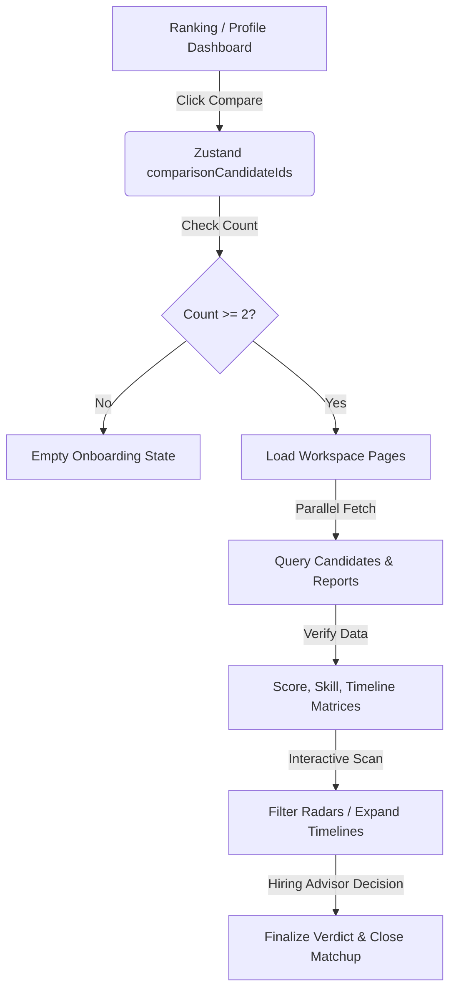

# AI Candidate Comparison Workspace Documentation (Phase 9)

A high-fidelity comparison dashboard enabling recruiters and hiring managers to compare 2–5 candidates side-by-side.

---

## 1. Component Hierarchy

The workspace is organized hierarchically as follows:

```
[CandidateComparisonPage] (Main Orchestrator)
 ├── [ComparisonToolbar] (Action headers, clear, add, export, share buttons)
 ├── [SelectedCandidatesBar] (Horizontal glassmorphic mini-cards showing who is being compared)
 ├── [ComparisonWinnerBanner] (Trophy-themed highlight callout recommending the cohort leader)
 ├── [ComparisonInsights] (dynamic cards containing key AI-derived comparison insights)
 ├── [ComparisonRadarChart] (Recharts overlay comparing candidate dimension profiles)
 ├── [ComparisonTable] (Parameter comparison grid highlighting lead score items)
 ├── [SectionContainer] (Accordion block wrappers)
 │    └── [ComparisonGrid] (Responsive dynamic-columns flex container)
 │         ├── [ComparisonScoreCard] (Score lists and animated progress bars)
 │         ├── [ComparisonSkills] (Matched/missing/preferred skill badges)
 │         ├── [ComparisonTimeline] (Vertical, expandable career timeline nodes)
 │         ├── [ComparisonReliability] (Integrity index, quality checks, neutral risk rating)
 │         ├── [ComparisonBehavior] (Collaboration scores and responsive indicators)
 │         └── [ComparisonRecommendation] (Verdict tiers, confidence rates, rationale text)
 │              └── [ComparisonActions] (View profile, ask copilot, dossier, bookmark)
 └── [StickyCompareFooter] (Float-in bottom panel for quick finalizing when scrolling)
```

---

## 2. State Management

We use a persisted Zustand store, `useCandidateStore`, defined in [candidateStore.ts](file:///d:/Engineering/Hackathon%20Projects/Finance%20Agent/frontend/src/store/candidateStore.ts), to maintain candidate selections across sessions:

- **State Properties:**
  - `comparisonCandidateIds`: Array of candidate ID strings (`CAND_XXXXXXX`). Supports 2 to 5 candidates.
  - `preferredChartType`: `'radar' | 'bar'` (persists visual selection).
  - `expandedSections`: Array of strings containing keys of active accordion panels.
- **Actions:**
  - `addComparisonCandidate(id)`: Appends an ID if space permits (limit 5).
  - `removeComparisonCandidate(id)`: Removes a single candidate.
  - `clearComparison()`: Clears the selection list.
  - `toggleExpandedSection(sectionId)`: Expands or collapses custom accordion sections.

---

## 3. API Integration

We leverage `@tanstack/react-query` to pull candidate files in parallel, allowing loading states to display beautiful shimmers and error boundaries to catch missing items gracefully.

- **Query Hooks:**
  - `useQueries` (React Query): Dynamic array of queries triggering parallel calls to `candidateService.getCandidate(id)` for every ID in `comparisonCandidateIds`.
  - `useQueries` (React Query Reports): Parallel queries triggering `copilotService.generateReport(id, jdText)` to obtain AI-generated recruitment metrics.
- **API Cache Strategy:**
  - Profile queries: 10 minutes stale time.
  - Reports queries: 5 minutes stale time.

---

## 4. Comparison Workflow



---

## 5. Animation Strategy

We use `framer-motion` to make the workspace feel reactive, fluid, and premium:

- **Transitions:**
  - Columns enter with spring dynamics: `stiffness: 140`, `damping: 20` to prevent jarring popups.
  - Skeletons use continuous background shimmers.
  - Mini cards enter and exit with scale transitions via `AnimatePresence`.
  - Accordion panels animate height updates smoothly (`height: "auto"`).
- **Reduced Motion:**
  - Animations respect browser accessibility rules (`prefers-reduced-motion: reduce`), reverting to instant state toggles.

---

## 6. Accessibility Notes

- **Keyboard Controls:** All buttons, header toggles, and cards support focus outlines and standard `Enter` key activations.
- **Contrast Check:** Color highlights (such as `emerald` and `amber` text) are paired with dark translucent backgrounds to maintain WCAG AA contrast compliance.
- **ARIA Elements:** Sections use `aria-expanded` and semantic landmarks (`article`, `section`, `nav`).
