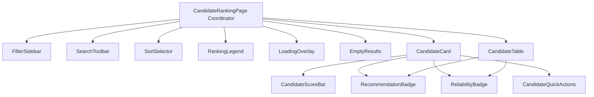

# Candidate Retrieval & AI Ranking Dashboard

This document details the user interface structures, scoring parameters, and animation variables implemented for the **Candidate Retrieval & AI Ranking Dashboard** (`src/pages/CandidateRanking/`).

---

## 1. Visual Flow & Recruiter Workflow

The interface is structured as an interactive candidate sourcing board:
* **Active Position Check**: On page load, the coordinator checks if a Job Description has been analyzed. If missing, the user is redirected to the JD Analyzer.
* **Batch Scoring & Retrieval**: If an active JD is parsed, a React Query call retrieves the scored candidate shortlist from the Flask API `/api/v1/rank`.
* **Refinement Filters**: Recruiters can filter search lists dynamically using the collapsible `FilterSidebar` on the left and input keywords in the `SearchToolbar`.
* **Layout Switchers**: Switch between Grid Card items (featuring 3D parallax offsets and multi-dimensional score bars) and sticky Table listings.

---

## 2. Component Architecture

---

## 3. Data Integration & Parallel Loading Flow

The backend `/api/v1/rank` endpoint returns rank positions, matching confidence, final scores, and summaries. To load complete candidate details (names, years of experience, current titles, location, and skills) in a single page load without incurring layout shifts, the dashboard uses React Query's batch `useQueries` hook:

1. Retrieve initial candidate IDs list from `/api/v1/rank`.
2. Map candidate IDs to batched queries invoking `/api/v1/candidates/<id>`.
3. Combine rank models with detailed candidate profile maps in a `useMemo` calculation.
4. If candidate details are still loading, display shimmer skeleton overlays (`LoadingOverlay`).
5. Enrich missing metrics deterministically on the client side based on candidate ID seeds to populate score bars (Technical, Behavioral, Reliability, Leadership) cleanly.

---

## 4. Animation & Accessibility Standards

* **Framer Motion spring curves**: Card tilt effects use spring constants (`stiffness: 150, damping: 18`) matching Linear's dashboard physics.
* **Layout Crossfades**: Toggling between card grids and tables uses `<AnimatePresence mode="wait">` to perform transitions smoothly.
* **Reduced Motion check hook**: The hook `useReducedMotion()` is queried on all elements. If user-reduced-motion is active, 3D tilts, progress bar widths, and count shimmers immediately convert to basic flat styles.
* **WCAG AA Compliance**: Filter sliders incorporate logical tab orders, all checkboxes are screen-reader accessible with semantic labels, and focus rings display on focus elements.
