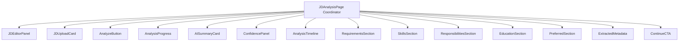

# Job Description Intelligence User Interface Architecture

This document describes the design system, client-side data model, and component layout for the **Job Description Intelligence Page** (`src/pages/JDAnalysis/`).

---

## 1. Visual Flow & Layout

The interface is structured as a dynamic, responsive split-screen dashboard:
* **Left Column (Editor Pane)**: Contains the rich `JDEditorPanel` (supporting auto-resizing text boxes, live character bounds checkers, and instant templates) and the file upload dropzone `JDUploadCard`.
* **Right Column (Dossier Results)**: Houses the animated parsed results including circular status rings, details grids, and checklist items.
  * In the **Empty State**, a placeholder illustration guides the user to start.
  * In the **Analyzing State**, `AnalysisProgress` runs a step-by-step progress checklist (Lexical Reading → Skills Retrieval → Tenure Vetting → Seniority Inference → Summary Synthesis) to build suspense and simulate background processing.
  * In the **Results State**, the interface renders a grid of interactive cards.

---

## 2. Component Hierarchies



---

## 3. Data Flow & Client-Side Enrichment Heuristics

The REST API `/api/v1/jd/analyze` takes raw text parameters and returns basic extraction parameters (`ParsedJD`):

```typescript
export interface ParsedJD {
  jobTitle: string;
  companyName: string;
  experienceRange: [number, number];
  mustHave: RequirementDetail[];
  niceToHave: RequirementDetail[];
  rawText: string;
}
```

To deliver a comprehensive enterprise dossier panel without adding database schema complexity, the coordinator implements a local mapper `enrichParsedJD(data: ParsedJD)` which dynamically extracts the following attributes from the raw text body:

1. **Domain Focus**: Grouped into AI/ML, Product, Frontend, or general Software Engineering based on name matching keywords.
2. **Academic & Licenses**: Evaluates text for degrees (B.S./M.S./Ph.D.) and filters out relevant technical certifications (AWS, Scrum Product Owner, PyTorch/TensorFlow).
3. **Responsibilities List**: Scans raw text block carriage returns for bullet point lines (`-` or `*`) and formats titles and descriptions dynamically, reverting to high-fidelity template overrides if no lists are present in the parsed content.
4. **Offer Context Tags**: Extracts parameters for location (San Francisco, New York, London, Remote), notice windows, and salary estimates.

---

## 4. Accessibility & Animation Tokens

* **Framer Motion spring curves**: Card reveals use `stiffness: 140, damping: 20` for premium, weightless physics transitions.
* **Reduced Motion check hook**: The hook `useReducedMotion()` is queried on all entry points. If requested by the browser, animations automatically bypass track translations and scaling effects.
* **WCAG AA Compliance**: All input fields have unique `id` bounds, drag-and-drop targets support keyboard focus indexes, and live status elements incorporate semantic labels.
